# Fashon-MNISTのウェブデモ

## 仮想環境のセットアップ

Python 3.11以降が必要。pyenvがあればそれを使う。

```sh
pyenv --install 3.11.15
pyenv global 3.11.15
```

```sh
python3 -m venv .venv
source .venv/bin/activate
python3 -m pip install --upgrade pip
python3 -m pip install tensorflow tensorflowjs
```

Macの場合はpyenvで指定しても良いが、仮想環境を作るときに`python3.11`を使ってもよい。仮想環境をアクティベートした後は`python3`として実行できる。

```sh
python3.11 -m venv .venv
source .venv/bin/activate
python3 -m pip install --upgrade pip
python3 -m pip install tensorflow 
```

## 訓練

モデルを訓練する。

```sh
python3 train.py
```

出力。

```txt
Epoch 1/5
1875/1875 ━━━━━━━━━━━━━━━━━━━━ 3s 1ms/step - accuracy: 0.8266 - loss: 0.4958    Epoch 2/5
1875/1875 ━━━━━━━━━━━━━━━━━━━━ 2s 1ms/step - accuracy: 0.8658 - loss: 0.3749  
Epoch 3/5
1875/1875 ━━━━━━━━━━━━━━━━━━━━ 2s 1ms/step - accuracy: 0.8769 - loss: 0.3376  
Epoch 4/5
1875/1875 ━━━━━━━━━━━━━━━━━━━━ 2s 1ms/step - accuracy: 0.8852 - loss: 0.3126  
Epoch 5/5
1875/1875 ━━━━━━━━━━━━━━━━━━━━ 2s 1ms/step - accuracy: 0.8916 - loss: 0.2939  
313/313 ━━━━━━━━━━━━━━━━━━━━ 0s 878us/step - accuracy: 0.8716 - loss: 0.3586

Test accuracy: 0.8715999722480774

Model was saved.
```

実行後、訓練した結果の重みが`model.keras`に保存される。

## チェック

保存されたモデルをロードして精度をチェックする。学習に使っていないテストデータを100個入力し、何個正解したかを調べる。


```sh
python3 check.py
```

出力。

```txt
0: true=Boot     pred=Boot     Correct
1: true=Pullover pred=Pullover Correct
2: true=Trouser  pred=Trouser  Correct
(snip)
98: true=Coat     pred=Coat     Correct
99: true=Pullover pred=Pullover Correct

Accuracy: 86/100 = 86.00%
```

## 重みをJavaScript用にエクスポート

Python側から重みをエクスポート。

```sh
python3 export.py
```

```sh
Saved artifact at 'export'. The following endpoints are available:

* Endpoint 'serve'
  args_0 (POSITIONAL_ONLY): TensorSpec(shape=(None, 28, 28), dtype=tf.float32, name='input_layer')
Output Type:
  TensorSpec(shape=(None, 10), dtype=tf.float32, name=None)
Captures:
  5170739888: TensorSpec(shape=(), dtype=tf.resource, name=None)
  5171496384: TensorSpec(shape=(), dtype=tf.resource, name=None)
  5171496208: TensorSpec(shape=(), dtype=tf.resource, name=None)
  5171496912: TensorSpec(shape=(), dtype=tf.resource, name=None)
Model was exported.
```

情報が`export`というディレクトリに保存される。さらにそれをJSで読める形に変換。

```sh
tensorflowjs_converter export docs/model
```

`export`にある情報が`docs/model`に保存される。


なお、setuptoolsのバージョンによっては、以下のようなエラーが起きる場合がる。

```txt
Traceback (most recent call last):
  File "/home/watanabe/github/fashion-mnist-demo/.venv/bin/tensorflowjs_converter", line 3, in <module>
    from tensorflowjs.converters.converter import pip_main
  File "/home/watanabe/github/fashion-mnist-demo/.venv/lib/python3.12/site-packages/tensorflowjs/__init__.py", line 21, in <module>
    from tensorflowjs import converters
  File "/home/watanabe/github/fashion-mnist-demo/.venv/lib/python3.12/site-packages/tensorflowjs/converters/__init__.py", line 21, in <module>
    from tensorflowjs.converters.converter import convert
  File "/home/watanabe/github/fashion-mnist-demo/.venv/lib/python3.12/site-packages/tensorflowjs/converters/converter.py", line 38, in <module>
    from tensorflowjs.converters import tf_saved_model_conversion_v2
  File "/home/watanabe/github/fashion-mnist-demo/.venv/lib/python3.12/site-packages/tensorflowjs/converters/tf_saved_model_conversion_v2.py", line 51, in <module>
    import tensorflow_hub as hub
  File "/home/watanabe/github/fashion-mnist-demo/.venv/lib/python3.12/site-packages/tensorflow_hub/__init__.py", line 85, in <module>
    _ensure_tf_install()
  File "/home/watanabe/github/fashion-mnist-demo/.venv/lib/python3.12/site-packages/tensorflow_hub/__init__.py", line 61, in _ensure_tf_install
    from pkg_resources import parse_version
ModuleNotFoundError: No module named 'pkg_resources'
```

その場合はsetuptoolsを一度アンインストールし、バージョン80.9.0ををインストールすればよい。

```sh
python3 -m pip uninstall setuptools
python3 -m pip install "setuptools==80.9.0"
```

## 動作確認

VS CodeのLive Serverで `docs/index.html`を開いて動作確認。

## 学習データの例

| Bag | Boot | Coat | Dress | Pullover | Sandal | Shirt | Sneaker | Top |
|-----|------|------|-------|----------|--------|-------|---------|-----|
|  | 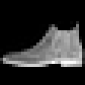 | 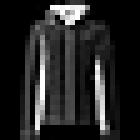 | 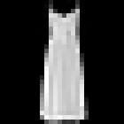 |  |  | 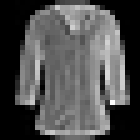 | 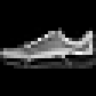 |  |
|  | 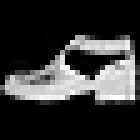 | 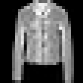 | 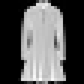 | 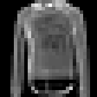 | 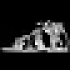 | 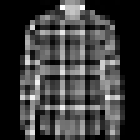 | 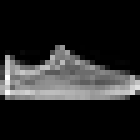 | 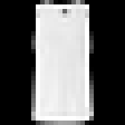 |
|  | 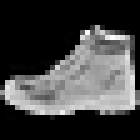 | 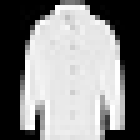 | 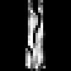 | 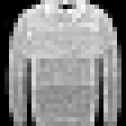 | 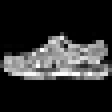 | 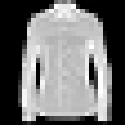 | 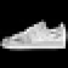 | 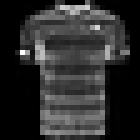 |
| 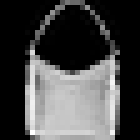 | 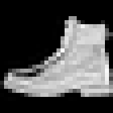 | 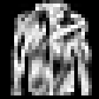 | 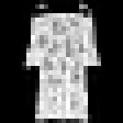 | 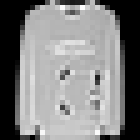 | 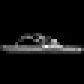 |  |  | 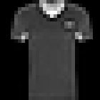 |
|  | 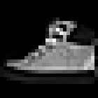 | 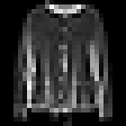 | 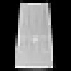 | 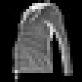 | 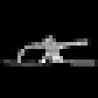 | 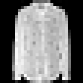 | 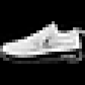 | 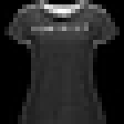 |
|  | 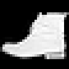 | 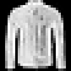 | 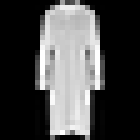 | 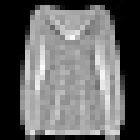 |  |  | 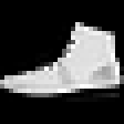 |  |
|  | 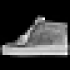 | 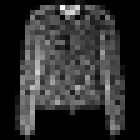 | 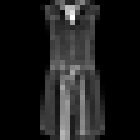 | 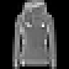 |  | 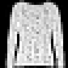 | 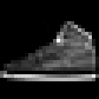 | 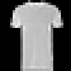 |
|  | 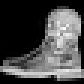 | 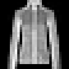 |  |  |  |  |  |  |
|  |  |  |  |  |  |  |  |  |
|  |  |  |  |  |  |  |  |  |

## LICENSE

MIT